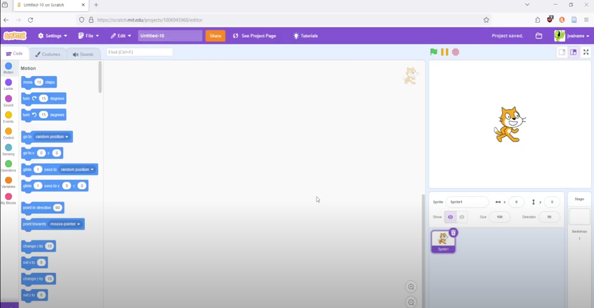

# Teaching Programming Fundamentals with Candy Catch
## :loudspeaker: About

Candy Catch is a 2-player competitive item catching game that uses Scratch. Players will learn about 'if-then' and 'while' statements.
The workshop strives to captivate students' interests toward the IT field by teaching them these basic programming concepts through a fun and interractive game developement process. 

## :bulb: Project Information 
* <b>Difficulty:</b> Easy
* <b>Target Audience:</b> Elementary - High School
* <b>Duration of Workshop:</b> 60 minutes
* <b>Needed Material:</b> Scratch.com, A computer with internet access
* <b> Learning Outcomes:</b> To teach participants the basic logical operators and statements, such as ‘If’ statements and ‘While’ loops through block-coding in Scratch
* <b>Main Technology:</b> Scratch 
* [Technology Ambassador Program](https://tapggc.org/) <b>(TAP)</b> is a project-based class that provides a collaborative environment for students to work with their fellow classmates on a semester-long project using technologies of their choice. TAP strives to increase participation in IT through numerous outreach activities and workshops that are designed to showcase the creative and fun side of technology.
 ### Commercial Video 
Click the image below to watch a quick commercial for the project    

### :pencil2: Team Photo
  
(From Left to Right - Anel Coralic, Austin Lanier, Derek Phung, Carl Mickiewicz)
* Anel Coralic
* Austin Lanier
* Derek Phung
* Carl Mickiewicz
### :mortar_board: Advisors
* Dr. Anca Doloc Mihu
* Dr. Cindy Robertson

## :page_with_curl: Project Description
Candy Catch is a project that teaches basic programming concepts to people of all ages in a fun and exciting way by helping create a game. 

## :open_hands: Outreach Activities
1. <b>TAP Expo</b>, April 1, 2021, Georgia Gwinnett College: to promote the IT field and encourage college students to sign up for TAP.
2. <b>Class Workshops</b>, April 12-14, 2021, Georgia Gwinnett College: to promote the IT field to non-IT students.

## :mag_right: Similar Projects
If you're interested in more workshops that utilize Scratch, check these out:
* [Leapformankind (Scratch)](https://github.com/TAP-GGC/leapformankind)
* [Makeysrace (Scratch)](https://github.com/TAP-GGC/makeysrace)
* [NinjaTurtler (Scratch with Makey-Makey)](https://github.com/TAP-GGC/NinjaTurtles)
* [Planimals (Scratch)](https://github.com/TAP-GGC/planimals)
* [LightUp (Scratch)](https://github.com/TAP-GGC/LightUp-Teaching-Programming-Basics-with-Scratch)
* [MonsterMakey (Scratch with Makey-Makey - Audio Project)](https://github.com/TAP-GGC/MonsterMakey)

## :computer: Technology
We are using Scratch, a block coding based software to introduce basic coding concepts to beginners through interactive games. Block Coding utilizes a drag-and-drop learning environment where programmers use blocks to construct basic programs.
Sphero is a robotic ball that can be programmed in the Sphero EDU app. The Sphero EDU app uses block coding similar to Scratch. 
|  |
| :------------------------------------------: | 
| [Scratch](https://scratch.mit.edu/) | 

 

## :candy: Project Setup

### Guide to Use Scratch

### Usage

Download Candy Catch [Here](resources/CandyCatch.sb3) and upload it to [Scratch](https://scratch.mit.edu/projects/editor/?tutorial=getStarted) to play! 

#### Game Objective
Catch as many candies as you can before the time runs out! Watch out for X's or else you will lose points.

#### Game Controls
* How To Start
  * Press the **Green Flag** to begin running the game
  * Then press **Spacebar** to start playing
* Player 1 uses the **WASD** keys
  * Move Left and Right: **A** and **D** keys
  * Jump: **W** key
* Player 2 uses the **Arrow** keys
  * Move Left and Right: **Left** and **Right** arrow keys
  * Jump: **Up** arrow key

## Short demo instructions
Below is a link to a video walkthrough of our workshop that anyone can do.  

## Workshop Instructions
Step By Step Guide: [PDF](documents/CandyCatch_step_by_step.pdf)  
Workshop Slides: [PDF](documents/Teaching%20Programming%20Fundamentals%20with%20Candy%20Catch%20Game.pdf), [PPTX](documents/Teaching%20Programming%20Fundamentals%20with%20Candy%20Catch%20Game.pptx) 
Commented Code: [PDF](documents/TeachingProgrammingFundamentalswithCandyCatchCommentedCode.pdf)  
